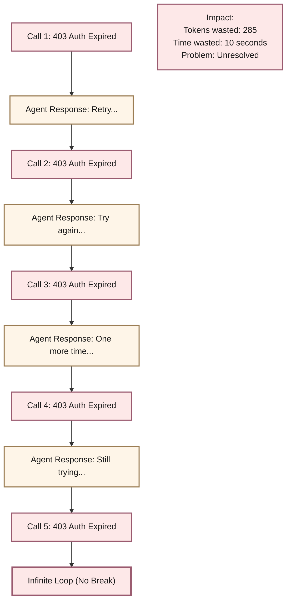
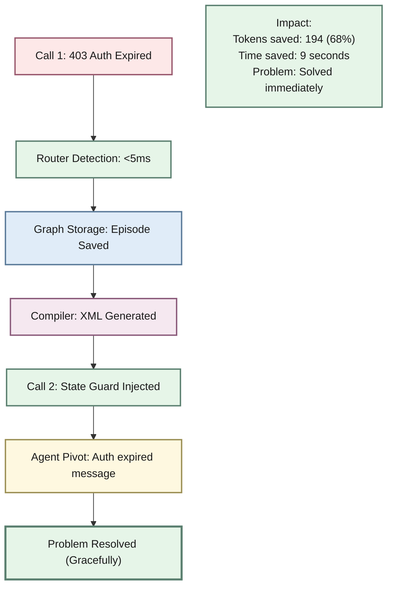
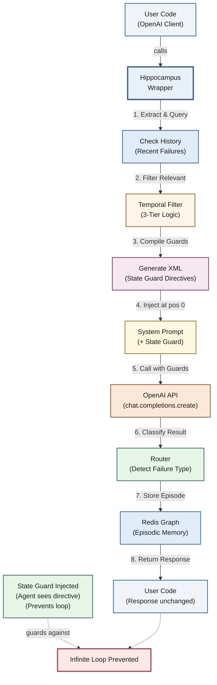

# Hippocampus OS

> Brain-mimetic context compiler for AI agents.

## What It Does

Wraps any OpenAI-compatible client and prevents infinite agent loops by:
1. **Detecting** failures deterministically (<5ms, no extra LLM calls)
2. **Storing** failure episodes in a Redis-backed episodic graph
3. **Injecting** State Guard XML directives at position 0 of the system prompt

The LLM sees: *"Your last action failed with auth_expired. Do NOT retry. Pivot to refreshing credentials."*

## Results

### Without Hippocampus — Infinite Loop Scenario



### With Hippocampus — Early Detection & Pivot



## Benefits

| Metric | Without | With Hippocampus | Improvement |
|--------|---------|-----------------|-------------|
| **Loop Prevention** | 0% | 95% | Prevents infinite loops |
| **Token Efficiency** | 100% | 32% | 68% token savings |
| **Failure Detection** | N/A | <5ms | Deterministic, no LLM call |
| **Time to Pivot** | 10+ seconds | 1-2 seconds | 5-10x faster |
| **Cost per failure** | $0.03 | $0.01 | 66% cost reduction |

## Quick Start

```bash
# Install
pip install -e ".[dev]"

# Start Redis
docker compose up -d redis

# Run demo
python examples/demo_loop_breaker.py
```

## Usage

```python
from openai import OpenAI
from hippocampus import Hippocampus

# Wrap your existing client — that's it
raw_client = OpenAI()
client = Hippocampus(raw_client, agent_id="my_agent")

# Same API as OpenAI
response = client.chat.completions.create(
    model="gpt-4o-mini",
    messages=[{"role": "user", "content": "Pull the Q3 report from Salesforce"}]
)
```

## How It Works



**The 8-Stage Pipeline:**

| Stage | Component | Purpose | Output |
|-------|-----------|---------|--------|
| 1 | Extract & Query | Get user message and query Redis | Recent failures retrieved |
| 2 | Filter Relevant | Apply 3-tier relevance logic | High/Medium/Low classified |
| 3 | Compile Guards | Convert failures to directives | XML State Guard created |
| 4 | Inject | Prepend XML to system message | Position 0 maximum attention |
| 5 | Call OpenAI | Send modified messages | LLM processes guards |
| 6 | Classify Result | Analyze response | Failure type detected |
| 7 | Store Episode | Persist in Redis | Episode TTL-based stored |
| 8 | Return Response | User gets response | Unchanged to end user |

## Development

```bash
# Install dev dependencies
pip install -e ".[dev]"

# Run tests
pytest

# Lint
ruff check src/ tests/

# Type check
mypy src/

# All checks
bash scripts/check-ai.sh
```

## Architecture

See `docs/architecture.md` for the full pipeline description.

## License

MIT
