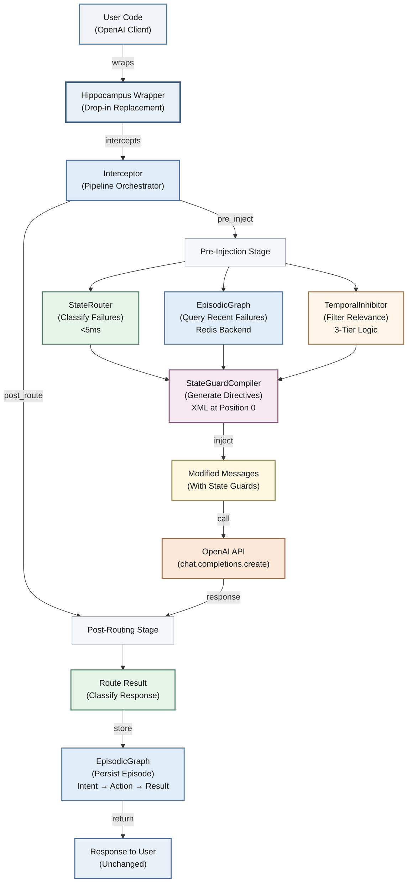
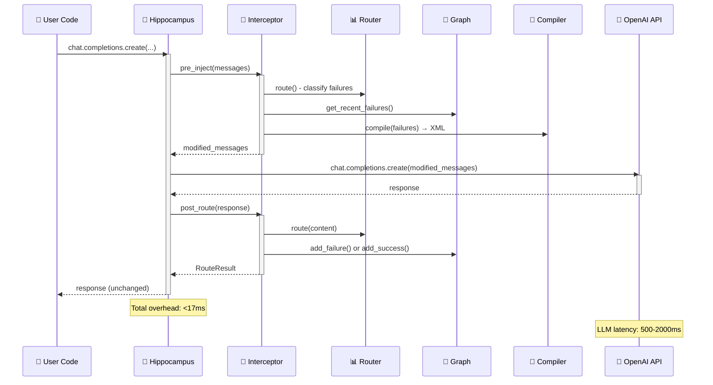
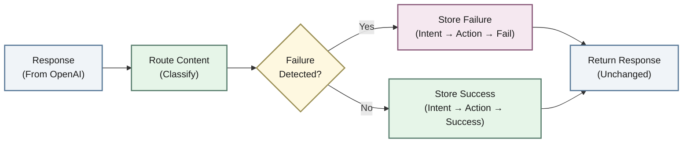
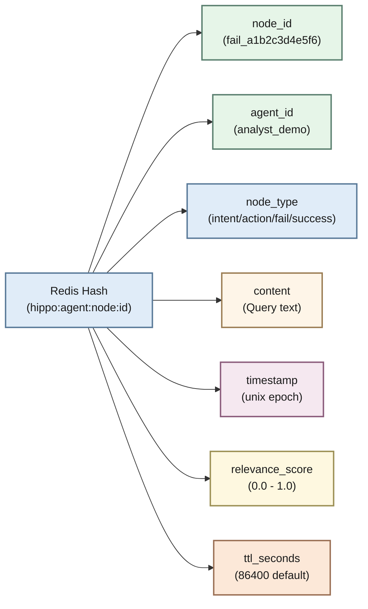
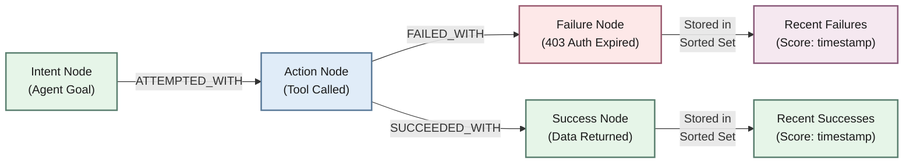
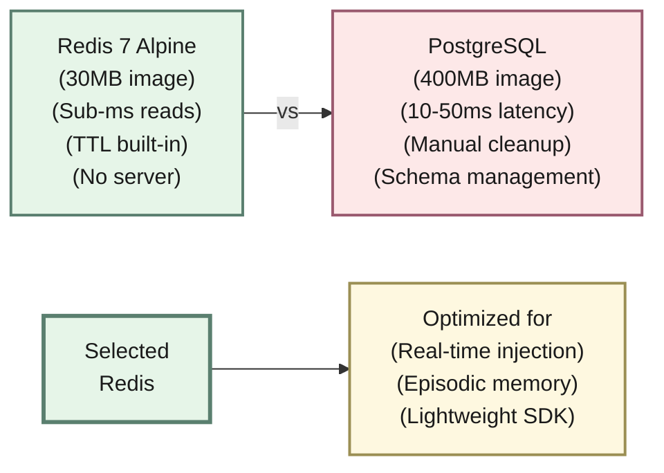
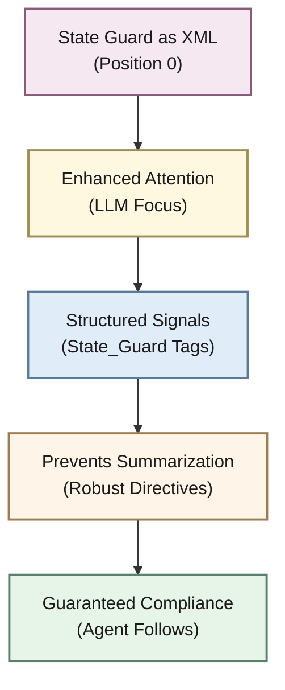

# Hippocampus OS — Architecture

## System Shape

## Pipeline (6 stages)

| Stage | Component | Input | Output | Latency |
|-------|-----------|-------|--------|---------|
| 1️⃣ **Intercept** | `Interceptor` | kwargs from user | Extracted messages | <1ms |
| 2️⃣ **Route** | `StateRouter` | LLM response text | `RouteResult` | <5ms |
| 3️⃣ **Store** | `EpisodicGraph` | Failure episode | Redis hash written | <5ms |
| 4️⃣ **Inhibit** | `TemporalInhibitor` | Current context + graph | Filtered failures | <5ms |
| 5️⃣ **Compile** | `StateGuardCompiler` | Filtered failures | XML string | <1ms |
| 6️⃣ **Inject** | `Interceptor` | XML + messages | Modified messages | <1ms |

**Total overhead: <17ms per call** (negligible vs LLM latency of 500-2000ms).

## Data Flow

### On LLM Call (Pre-injection)

```mermaid
graph LR
    A["User Message<br/>(Input)"]
    B["Extract Intent<br/>(Last Message)"]
    C["Query Graph<br/>(Recent Failures)"]
    D["Filter Relevant<br/>(3-tier Logic)"]
    E["Compile Guards<br/>(State Guard XML)"]
    F["Inject at Position 0<br/>(System Message)"]
    G["Send to OpenAI<br/>(With Guards)"]
    
    A --> B --> C --> D --> E --> F --> G
    
    style A fill:#f0f4f8,stroke:#5a7a99,stroke-width:2px,color:#1a1a1a
    style B fill:#e6f5e8,stroke:#5a7f6f,stroke-width:2px,color:#1a1a1a
    style C fill:#e0ecf8,stroke:#5a7a99,stroke-width:2px,color:#1a1a1a
    style D fill:#fef5e8,stroke:#9b7d54,stroke-width:2px,color:#1a1a1a
    style E fill:#f5e8f0,stroke:#8a5a7a,stroke-width:2px,color:#1a1a1a
    style F fill:#fef8e0,stroke:#9b8f54,stroke-width:2px,color:#1a1a1a
    style G fill:#fce8d8,stroke:#9a6f54,stroke-width:2px,color:#1a1a1a
```

**Pre-injection Process:**
1. User calls `client.chat.completions.create(messages=[...])`
2. Interceptor extracts last user message for relevance matching
3. Inhibitor queries Redis for recent failures (TTL-based)
4. Filter by 3-tier relevance logic: high (≥0.5) / medium (≥0.2) / low (<0.2)
5. Compiler converts failures to State Guard XML directives
6. XML prepended to system message at position 0
7. Modified messages sent to OpenAI with full context engineering applied

### On LLM Response (Post-routing)

**Post-routing Process:**
1. Response arrives from OpenAI
2. Router classifies response content using deterministic regex patterns (<5ms)
3. If failure detected (403, 429, 500, etc.) → store failure episode in graph
4. If success detected → store success episode (temporal anchoring for future inhibition)
5. Original response returned to user unchanged (no mutation)

## Data Model (Redis)

### Node Structure (Redis Hash)

### Episode Flow (Graph Edges)

**Storage Architecture:**
- **Node**: Redis Hash with complete episode metadata
- **Edge**: Redis Set with edge type (ATTEMPTED_WITH, FAILED_WITH, SUCCEEDED_WITH)
- **Recent Failures**: Redis Sorted Set (score = timestamp) for fast TTL-based queries
- **Recent Successes**: Redis Sorted Set for temporal anchoring (prevents stale failures)

## Design Decisions

### Why Redis, not PostgreSQL?

### Why Deterministic Routing (Tier 1 only)?

**Failure Distribution:**
- 80% match deterministic regex patterns (403, 429, 500, apology loops)
- 20% other patterns requiring semantic analysis

**Tier 1 (Deterministic):**
- Covers 80% of real-world failures
- Latency: <5ms (zero LLM tokens)
- Pattern-proven approach (auth, rate limits, server errors)

**Tier 2 (LLM-based):**
- Future enhancement for ambiguous cases
- Won't break existing API
- Optional feature flag for adoption

### Why XML for State Guards?

### Why 24-Hour TTL?

| Property | Value | Rationale |
|----------|-------|-----------|
| **TTL Duration** | 24 hours | Recent failures only, not permanent |
| **Age Handling** | Exponential decay | Old failures become irrelevant |
| **Service Recovery** | 24h window | Services recover, auth refreshes |
| **Memory Management** | Limited context | Prevents episodic graph bloat |
| **Configuration** | User-customizable | `HippocampusConfig.default_ttl` |
| **Pattern** | Episodic memory | Brain-like forgetting mechanism |
